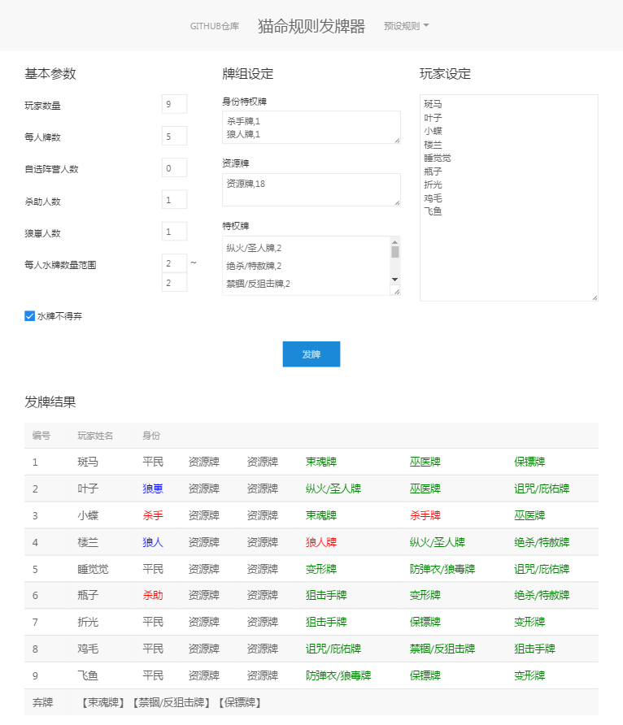

# 猫命游戏工具 

    tsc cathasnlife.ts --charset "utf8"

### 猫命7人规则

[https://github.com/JiYouMCC/CatHasNLives/blob/master/doc/rule_of_7.md](https://github.com/JiYouMCC/CatHasNLives/blob/master/doc/rule_of_7.md)

    狙击手牌,2
    束魂牌,2
    巫医牌,2
    防弹衣/狼毒牌,2
    禁锢/反狙击牌,2
    绝杀/特赦牌,2
    诅咒/庇佑牌,2
    纵火/圣人牌,2
    保镖牌,3
    阿米巴变形牌,3
    
    庶民牌,12
    

### 猫命9人规则

[https://github.com/JiYouMCC/CatHasNLives/blob/master/doc/rule_of_9.md](https://github.com/JiYouMCC/CatHasNLives/blob/master/doc/rule_of_9.md)

 (内置的9人规则和这里的参数不一样)

    狙击手牌,3
    束魂牌,3
    巫医牌,3
    防弹衣/狼毒牌,3
    禁锢/反狙击牌,2
    绝杀/特赦牌,2
    诅咒/庇佑牌,2
    纵火/圣人牌,2
    保镖牌,4
    阿米巴变形牌,4
    
    资源牌,27
    

## 引用类
[uikit 3.0.0-beta.12](https://getuikit.com/) 

选这个只是想试一试除了bootstrapt以外的css UI库，感觉这个略干净，但是不是太好用

[jquery 3.1.1](https://jquery.com/) 

原来没想用，结果uikit依赖于这个
